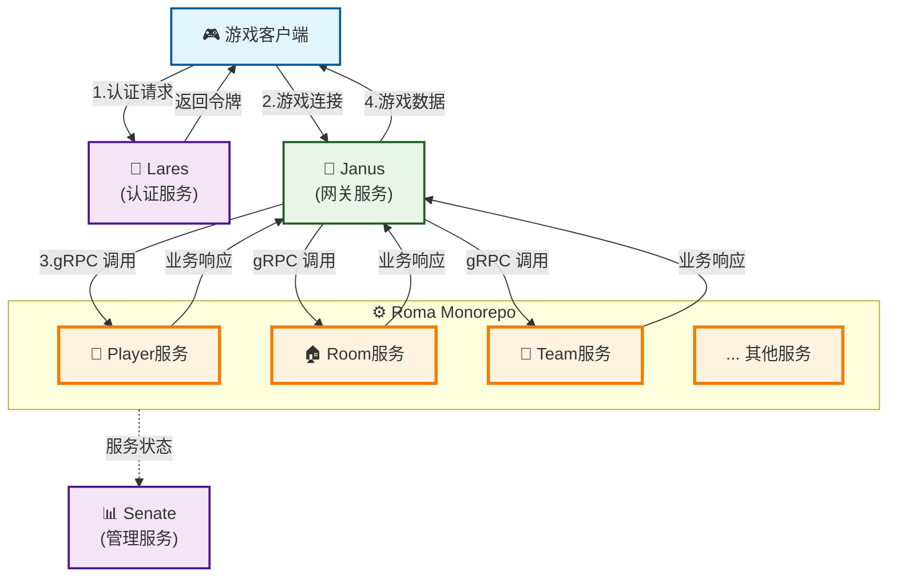
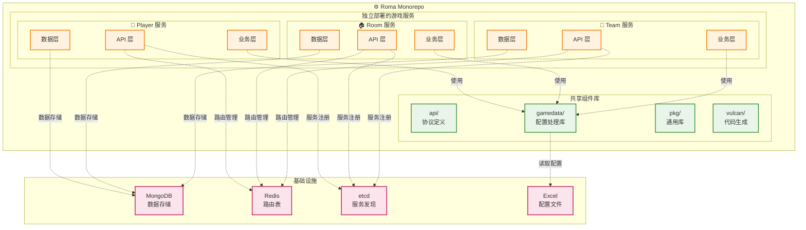

<div align="center">
  <h1>⚙️ Roma 游戏核心业务服务</h1>
  <p><em>go-pantheon 生态系统的高性能游戏核心业务服务框架</em></p>
</div>

<p align="center">
<a href="https://github.com/go-pantheon/roma/actions/workflows/test.yml"></a>
<a href="https://github.com/go-pantheon/roma/releases"></a>
<a href="https://pkg.go.dev/github.com/go-pantheon/roma"></a>
<a href="https://goreportcard.com/report/github.com/go-pantheon/roma"></a>
<a href="https://github.com/go-pantheon/roma/blob/main/LICENSE"></a>
<a href="https://deepwiki.com/go-pantheon/roma"></a>
</p>

<p align="center">
  <a href="README.md">English</a> | <a href="README-zh.md">中文</a>
</p>

## 关于 Roma

Roma 是基于微服务架构的高性能游戏核心业务服务框架，采用 Go 语言开发。Roma 以 monorepo 形式组织，包含多个独立部署的游戏服务（如 Player、Room、Team 等），每个服务专注于特定的游戏业务领域。Roma 是 go-pantheon 生态系统的核心组件，负责处理具体的游戏业务逻辑和数据管理。

更多信息请查看：[deepwiki/go-pantheon/roma](https://deepwiki.com/go-pantheon/roma)

## 关于 go-pantheon 生态系统

**go-pantheon** 是一个开箱即用的游戏服务器框架，基于微服务架构提供高性能、高可用的游戏服务器集群解决方案。Roma 作为游戏业务逻辑实现组件，与其他核心服务协作构成完整的游戏服务生态系统：

- **Roma**: 游戏核心业务服务，负责游戏逻辑处理和数据管理
- **Janus**: 网关服务，负责客户端连接处理和请求转发
- **Lares**: 账户服务，负责用户认证和账户管理
- **Senate**: 后台管理服务，提供运营管理接口

## 核心优势

### 🏗️ 微服务架构
- **Monorepo 管理**: 统一代码管理，独立服务部署
- **动态扩缩容**: 用户无感知的在线扩容和负载均衡
- **服务发现**: 基于 etcd 的自动服务注册和发现

### ⚡ 高性能处理
- **异步架构**: 分布式Worker模式和事件驱动设计
- **智能路由**: 双层路由表精确消息投递
- **内存优化**: 高效内存管理和对象池设计

### 🛠️ 开发效率
- **代码生成**: 基于 Protobuf 和 Excel 的自动化代码生成
- **热重载**: 配置表热更新和灰度发布支持
- **测试工具**: 内置 Mercury 客户端模拟工具

### 📊 运维监控
- **链路追踪**: OpenTelemetry 分布式追踪
- **指标监控**: Prometheus 实时监控和告警
- **健康检查**: 完善的服务健康检查和故障转移

## 游戏模块支持

Roma 当前支持以下游戏业务模块：

| 模块         | 描述     | 功能                             |
| ------------ | -------- | -------------------------------- |
| **Player**   | 玩家服务 | 玩家数据管理、进度同步、属性管理 |
| **Room**     | 房间服务 | 房间创建、管理                   |
| **Team**     | 队伍服务 | 队伍创建、加入、管理等功能       |
| **Fight**    | 战斗服务 | 战斗系统相关功能                 |
| **Chat**     | 聊天服务 | 聊天系统相关功能                 |
| **Notice**   | 通知服务 | 通知系统相关功能                 |
| **Activity** | 活动服务 | 活动系统相关功能                 |
| **Mail**     | 邮件服务 | 邮件系统相关功能                 |
| **Guild**    | 公会服务 | 公会系统相关功能                 |

## 系统架构

### 系统架构总览

**组件关系图：**



### Roma Monorepo 架构

**Roma 内部架构图：**



### 核心架构特性

Roma 提供完整的游戏业务流程支持，采用分布式Worker模式和事件驱动架构，实现高并发低延迟的游戏业务处理。通过双层路由表设计确保消息精确投递，支持多实例集群部署和数据一致性保障。


## 技术栈

Roma 使用以下核心技术：

| 技术/组件     | 用途               | 版本    |
| ------------- | ------------------ | ------- |
| Go            | 主要开发语言       | 1.24+   |
| go-kratos     | 微服务框架         | v2.8.4  |
| gRPC          | 服务间通信         | v1.73.0 |
| Protobuf      | 数据序列化         | v1.36.6 |
| etcd          | 服务发现与注册     | v3.6.1  |
| Redis         | 路由表缓存         | v9.11.0 |
| MongoDB       | 数据存储           | v2.2.2  |
| PostgreSQL    | 数据存储           | v16.3   |
| OpenTelemetry | 分布式链路追踪     | v1.37.0 |
| Prometheus    | 监控系统           | v1.22.0 |
| Google Wire   | 依赖注入           | v0.6.0  |
| zap           | 日志记录           | v1.27.0 |
| Buf           | Protobuf 管理      | Latest  |
| fabrica-kit   | go-pantheon 工具包 | v0.0.20 |
| fabrica-net   | go-pantheon 网络库 | v0.0.21 |
| fabrica-util  | go-pantheon 工具库 | v0.0.28 |


## 快速开始

### 快速体验

如果您想快速体验Roma游戏服务，请按照以下步骤操作：

### 1. 安装基础服务

请确保以下服务已安装并正常运行：
- **etcd**: 服务发现和配置管理
- **MongoDB**: 主要数据存储
- **PostgreSQL**: 关系型数据存储
- **Redis**: 路由表存储

### 2. 配置服务

```bash
# 复制配置模板
cd app/player
cp -r configs.tmpl/ configs/

# 编辑配置文件，修改以下内容：
# - 数据库连接信息
# - 服务端口设置
# - etcd 和 Redis 连接地址
```

配置文件示例修改：
```yaml
# configs/config.yaml
server:
  http:
    addr: 0.0.0.0:8000
  grpc:
    addr: 0.0.0.0:9000

data:
  database:
    source: "mongodb://localhost:27017/roma"
  redis:
    addr: "localhost:6379"

registry:
  etcd:
    endpoints: ["localhost:2379"]
```

### 3. 启动Janus网关服务

首先需要启动Janus网关服务作为流量入口：

```bash
# 请参考 go-pantheon/janus 项目文档启动网关服务
# 确保Janus服务在默认端口启动并能够发现Roma服务
```

### 4. 启动Player服务

```bash
# 在 app/player 目录下
make run
```

### 5. 配置并启动Mercury测试工具

```bash
# 复制Mercury配置模板
cd mercury
cp -r configs.tmpl/ configs/

# 编辑配置文件，检查TCP连接地址
# 确保配置中的TCP地址指向Janus网关服务
```

配置文件检查要点：
```yaml
# mercury/configs/config.yaml
client:
  tcp:
    addr: "localhost:17001"  # Janus网关TCP端口
```

```bash
# 在项目根目录启动Mercury
make mercury
```

Mercury将通过Janus网关连接到Player服务并执行基础功能测试。

## 项目结构

Roma 采用 monorepo 架构，统一管理多个独立部署的微服务：

```
.
├── api/                # 共享 API 协议定义
│   ├── client/         # 客户端通信协议
│   ├── db/             # 数据库模型定义
│   └── server/         # 服务端内部协议
├── app/                # 独立游戏服务集群
│   ├── player/         # 玩家服务（独立部署）
│   └── room/           # 房间服务（独立部署）
├── exceldata/          # 共享游戏配置数据
├── gamedata/           # 共享游戏数据处理逻辑
├── gen/                # 自动生成代码
├── mercury/            # 独立测试工具服务
├── pkg/                # 共享库和核心组件
│   ├── universe/       # 核心业务框架
│   └── util/           # 工具函数
└── vulcan/             # 独立代码生成工具服务
```


### 开发环境搭建

如果您想参与Roma的开发，请按照以下步骤搭建完整的开发环境：

#### 1. 初始化开发环境

```bash
# 安装开发工具链
make init
```

这将安装以下开发工具：
- Protocol Buffers 编译器
- go-kratos 代码生成工具
- Wire 依赖注入工具
- golangci-lint 代码检查工具

#### 2. 添加新的API协议（以在Player服务下添加新模块为例）

**添加客户端协议**

**重要提醒**：
- 模块名和文件名需要保持一致
- 客户端消息使用 `CS` (Client to Server) 和 `SC` (Server to Client) 前缀
- 服务端推送消息使用 `@push` 注释标记

1. 在 `api/client/message/` 目录下创建新的服务定义：

```protobuf
// api/client/message/item_service.proto (文件名与模块名一致)
syntax = "proto3";

package api.client.message;

service NewModuleService {
	// Dev command list
	rpc Echo (CSEcho) returns (SCEcho) {
		option (google.api.http) = {
			post: "/newmodule/echo"
			body: "*"
		};
	};
}

// 客户端请求消息（CS前缀）
message CSEcho {
  string msg = 1;
}

// 服务端响应消息（SC前缀）
// 定义响应码 0: 默认失败，1: 成功，其他: 自定义错误码
message SCEcho {
  Code code = 1; // 响应码
	enum Code {
		ErrUnspecified = 0; // Please try again later
		Succeeded = 1; // Succeeded
	}

  string msg = 2;
}

// 服务端推送消息
message SCPushEcho {
  string msg = 1;
}
```

2. 更新模块和序列定义：

```protobuf
// api/client/module/modules.proto
enum ModuleID {
  NewModule = 8; // 模块名与文件名一致
}

// api/client/sequence/newmodule.proto (文件名与模块名一致)
enum NewModuleSeq {
  Echo = 1;
  // @push（使用@push注释）
  PushEcho = 2;
}
```

**生成API协议代码**

协议编写完成后，运行以下命令生成代码：

```bash
# 生成API协议代码
make api
```

**如有需要，添加数据库模型**

在 `api/db/player/` 目录下定义数据模型：

```protobuf
// api/db/player/newmodule.proto
syntax = "proto3";

package player.v1;

option go_package = "api/db/player/v1;dbv1";


// Basic Information
message NewModuleProto {
  string name = 1; // @gotags: bson:"name"
  int32 type = 2; // @gotags: bson:"type"
  int64 created_at = 3; // @gotags: bson:"created_at"
}

// 将新模块添加到UserModuleProto中
message UserModuleProto {
  oneof module {
    // ...
    NewModuleProto new_module = 3;
  }
}

```


**生成DB协议代码**

协议编写完成后，运行以下命令生成代码：

```bash
# 生成数据库模型代码
make db
```

#### 3. 实现业务逻辑（参考app/player/internal/app/hero/gate架构）

**创建模块目录结构**

```bash
mkdir -p app/player/internal/app/newmodule/gate/{service,biz,domain,registry}
mkdir -p app/player/internal/app/newmodule/gate/domain/object
```

**创建Service层**

```go
// app/player/internal/app/newmodule/gate/service/newmodule.go
package service

import (
    "context"

    "github.com/go-kratos/kratos/v2/log"
    "github.com/go-pantheon/roma/app/player/internal/app/newmodule/gate/biz"
    "github.com/go-pantheon/roma/app/player/internal/core"
    climsg "github.com/go-pantheon/roma/gen/api/client/message"
)

type NewModuleService struct {
    climsg.UnimplementedNewModuleServiceServer

    uc  *biz.NewModuleUseCase
    log *log.Helper
}

func NewNewModuleService(logger log.Logger, uc *biz.NewModuleUseCase) climsg.NewModuleServiceServer {
    return &NewModuleService{
        log: log.NewHelper(log.With(logger, "module", "player/newmodule/gate/service")),
        uc:  uc,
    }
}

func (s *NewModuleService) Echo(ctx context.Context, cs *climsg.CSEcho) (*climsg.SCEcho, error) {
    // 转换为core.Context，访问用户数据和游戏状态
    return s.uc.Echo(ctx.(core.Context), cs)
}
```

**创建Biz层（业务逻辑层）**

```go
// app/player/internal/app/newmodule/gate/biz/newmodule.go
package biz

import (
    "github.com/go-kratos/kratos/v2/log"
    "github.com/go-pantheon/roma/app/player/internal/app/newmodule/gate/domain"
    "github.com/go-pantheon/roma/app/player/internal/core"
    climsg "github.com/go-pantheon/roma/gen/api/client/message"
)

func NewNewModuleUseCase(mgr *core.Manager, logger log.Logger,
    newmoduleDo *domain.NewModuleDomain,
) *NewModuleUseCase {
    uc := &NewModuleUseCase{
        log:         log.NewHelper(log.With(logger, "module", "player/newmodule/gate/biz")),
        mgr:         mgr,
        newmoduleDo: newmoduleDo,
    }

    // 注册事件监听器
    // mgr.RegisterOnCreatedEvent(uc.onCreated)

    return uc
}

type NewModuleUseCase struct {
    log         *log.Helper
    mgr         *core.Manager
    newmoduleDo *domain.NewModuleDomain
}

func (uc *NewModuleUseCase) Echo(ctx core.Context, cs *climsg.CSEcho) (*climsg.SCEcho, error) {
    sc := &climsg.SCEcho{}

    // 输入验证
    if len(cs.Msg) == 0 {
        sc.Code = climsg.SCEcho_ErrUnspecified
        return sc, nil
    }

    // 调用领域服务处理业务逻辑
    result, err := uc.newmoduleDo.ProcessEcho(ctx, cs.Msg)
    if err != nil {
        uc.log.WithContext(ctx).Errorf("process echo failed: %+v", err)
        sc.Code = climsg.SCEcho_ErrUnspecified
        return sc, nil
    }

    // 标记用户数据已变更（用于自动保存）
    // ctx.Changed(object.ModuleKey)

    sc.Code = climsg.SCEcho_Succeeded
    sc.Msg = result

    return sc, nil
}
```

**创建Domain层（领域服务层）**

```go
// app/player/internal/app/newmodule/gate/domain/newmodule.go
package domain

import (
    "github.com/go-kratos/kratos/v2/log"
    "github.com/go-pantheon/roma/app/player/internal/core"
    // "github.com/go-pantheon/roma/app/player/internal/app/newmodule/gate/domain/object"
)

type NewModuleDomain struct {
    log *log.Helper
}

func NewNewModuleDomain(logger log.Logger) *NewModuleDomain {
    return &NewModuleDomain{
        log: log.NewHelper(log.With(logger, "module", "player/newmodule/gate/domain")),
    }
}

func (do *NewModuleDomain) ProcessEcho(ctx core.Context, msg string) (string, error) {
    // 访问用户数据
    // user := ctx.User()

    // 实现具体的业务规则
    // 例如：验证权限、检查条件、更新状态等
    processedMsg := "Echo: " + msg

    do.log.WithContext(ctx).Infof("processed echo message: %s -> %s", msg, processedMsg)

    return processedMsg, nil
}
```

**创建Domain Object（领域对象）**

```go
// app/player/internal/app/newmodule/gate/domain/object/newmodule.go
package object

import (
    climsg "github.com/go-pantheon/roma/gen/api/client/message"
    dbv1 "github.com/go-pantheon/roma/gen/api/db/player/v1"
)

const ModuleKey = "newmodule"

// NewModuleData 领域对象，定义新模块的数据结构
type NewModuleData struct {
    Name      string
    Type      int32
    Count     int64
    CreatedAt int64
}

// 从数据库模型解码
func (o *NewModuleData) DecodeServer(p *dbv1.NewModuleProto) *NewModuleData {
    if p == nil {
        return o
    }

    o.Name = p.Name
    o.Type = p.Type
    o.CreatedAt = p.CreatedAt

    return o
}

// 编码为数据库模型
func (o *NewModuleData) EncodeServer() *dbv1.NewModuleProto {
    return &dbv1.NewModuleProto{
        Name:      o.Name,
        Type:      o.Type,
        CreatedAt: o.CreatedAt,
    }
}

// 编码为客户端协议（如果需要）
func (o *NewModuleData) EncodeClient() *climsg.NewModuleProto {
    return &climsg.NewModuleProto{
        Name: o.Name,
        Type: o.Type,
    }
}
```

**创建Registry层（服务注册）**

```go
// app/player/internal/app/newmodule/gate/registry/registry.go
package registry

import (
    "github.com/go-kratos/kratos/v2/log"
    "github.com/go-kratos/kratos/v2/transport/grpc"
    "github.com/go-kratos/kratos/v2/transport/http"
    climsg "github.com/go-pantheon/roma/gen/api/client/message"
)

func NewNewModuleRegistrar(svc climsg.NewModuleServiceServer) *NewModuleRegistrar {
    return &NewModuleRegistrar{
        svc: svc,
    }
}

type NewModuleRegistrar struct {
    svc climsg.NewModuleServiceServer
}

func (r *NewModuleRegistrar) GrpcRegister(s *grpc.Server) {
    climsg.RegisterNewModuleServiceServer(s, r.svc)
    log.Infof("Register newmodule gRPC service")
}

func (r *NewModuleRegistrar) HttpRegister(s *http.Server) {
    climsg.RegisterNewModuleServiceHTTPServer(s, r.svc)
    log.Infof("Register newmodule HTTP service")
}
```

#### 4. 配置依赖注入（Provider）

**各层Provider文件**

```go
// app/player/internal/app/newmodule/gate/service/provider.go
package service

import "github.com/google/wire"

var ProviderSet = wire.NewSet(
    NewNewModuleService,
)

// app/player/internal/app/newmodule/gate/biz/provider.go
package biz

import "github.com/google/wire"

var ProviderSet = wire.NewSet(
    NewNewModuleUseCase,
)

// app/player/internal/app/newmodule/gate/domain/provider.go
package domain

import "github.com/google/wire"

var ProviderSet = wire.NewSet(
    NewNewModuleDomain,
)

// app/player/internal/app/newmodule/gate/registry/provider.go
package registry

import "github.com/google/wire"

var ProviderSet = wire.NewSet(
    NewNewModuleRegistrar,
)

// app/player/internal/app/newmodule/gate/provider.go
package gate

import (
    "github.com/go-pantheon/roma/app/player/internal/app/newmodule/gate/biz"
    "github.com/go-pantheon/roma/app/player/internal/app/newmodule/gate/domain"
    "github.com/go-pantheon/roma/app/player/internal/app/newmodule/gate/registry"
    "github.com/go-pantheon/roma/app/player/internal/app/newmodule/gate/service"
    "github.com/google/wire"
)

var ProviderSet = wire.NewSet(
    biz.ProviderSet,
    domain.ProviderSet,
    service.ProviderSet,
    registry.ProviderSet,
)

// app/player/internal/app/newmodule/provider.go
package newmodule

import (
    "github.com/go-pantheon/roma/app/player/internal/app/newmodule/gate"
    "github.com/google/wire"
)

var ProviderSet = wire.NewSet(
    gate.ProviderSet,
)
```

**注册到应用层**

```go
// app/player/internal/app/provider.go
// 在现有的provider.go文件中添加NewModule的ProviderSet
var ProviderSet = wire.NewSet(
    // ... 现有的providers
    newmodule.ProviderSet,  // 添加这一行
)

// app/player/internal/server/http.go
// 注册HTTP服务
func NewHTTPServer(c *conf.Server,
    // ... 其他参数
    newmoduleRegistrar *newmoduleregistry.NewModuleRegistrar,
) *http.Server {
    // ... 服务器配置

    // 注册NewModule服务
    newmoduleRegistrar.HttpRegister(srv)

    return srv
}

// app/player/internal/server/grpc.go
// 注册gRPC服务
func NewGRPCServer(c *conf.Server,
    // ... 其他参数
    newmoduleRegistrar *newmoduleregistry.NewModuleRegistrar,
) *grpc.Server {
    // ... 服务器配置

    // 注册NewModule服务
    newmoduleRegistrar.GrpcRegister(srv)

    return srv
}
```

#### 5. 生成代码

```bash
# 生成依赖注入代码
make wire
```

#### 6. 构建和运行

```bash
# 构建服务
make build

# 启动服务
make run app=player
```

#### 7. 使用RESTful工具测试HTTP接口

Roma服务会自动生成HTTP接口，您可以使用Postman、curl或其他RESTful测试工具进行模块测试：

```bash
# 测试创建物品接口
curl -X POST http://localhost:19001/newmodule/echo \
  -H "Content-Type: application/json" \
  -d '{
    "msg": "Hello, World!"
  }'

# 测试新模块接口
curl -X GET http://localhost:19001/newmodule/echo \
  -H "Content-Type: application/json" \
  -d '{
    "msg": "Hello, World!"
  }'
```

您也可以使用Postman等图形化工具：
1. 导入生成的OpenAPI文档（通常在 `/swagger` 端点可访问）
2. 配置请求头和参数
3. 发送请求并验证响应结果

**测试要点**：
- 检查HTTP状态码是否正确
- 验证响应数据格式和内容
- 测试各种边界条件和错误情况
- 确认数据在数据库中正确存储

## 生态集成

Roma 与 go-pantheon 生态系统无缝集成：

- **Janus 网关**: 自动服务发现和路由转发，协议自动分发到对应模块
- **Senate 管理**: 支持后台管理接口，提供运营数据和管理功能


## 贡献指南

欢迎贡献代码！请遵循标准的 GitHub 工作流：Fork → 分支 → 提交 → Pull Request

**开发规范**: 遵循 Go 最佳实践，添加测试，更新文档，确保 CI 通过

## 许可证

本项目基于 [MIT License](https://github.com/go-pantheon/roma/blob/main/LICENSE) 开源协议。

---

<div align="center">
  <p>✨ <strong>Roma 游戏核心业务服务</strong> - 高性能游戏服务器框架<p>
  <p>🏛️ <em>go-pantheon 生态系统的一部分</em> 🏛️</p>
</div>
