<div align="center">
  <h1>⚙️ Roma Game Core Business Service</h1>
  <p><em>High-performance game core business service framework for the go-pantheon ecosystem</em></p>
</div>

<p align="center">
<a href="https://github.com/go-pantheon/roma/actions/workflows/test.yml"></a>
<a href="https://github.com/go-pantheon/roma/releases"></a>
<a href="https://pkg.go.dev/github.com/go-pantheon/roma"></a>
<a href="https://goreportcard.com/report/github.com/go-pantheon/roma"></a>
<a href="https://github.com/go-pantheon/roma/blob/main/LICENSE"></a>
<a href="https://deepwiki.com/go-pantheon/roma"></a>
</p>

<p align="center">
  <a href="README.md">English</a> | <a href="README-zh.md">中文</a>
</p>

## About Roma

Roma is a high-performance game core business service framework based on microservice architecture, developed in Go. Roma is organized as a monorepo, containing multiple independently deployable game services (such as Player, Room, Team, etc.), with each service focusing on specific game business domains. Roma is a core component of the go-pantheon ecosystem, responsible for handling specific game business logic and data management.

For more information, please visit: [deepwiki/go-pantheon/roma](https://deepwiki.com/go-pantheon/roma)

## About the go-pantheon Ecosystem

**go-pantheon** is an out-of-the-box game server framework that provides high-performance, high-availability game server cluster solutions based on microservice architecture. Roma serves as the game business logic implementation component, collaborating with other core services to form a complete game service ecosystem:

- **Roma**: Game core business service, responsible for game logic processing and data management
- **Janus**: Gateway service, responsible for client connection handling and request forwarding
- **Lares**: Account service, responsible for user authentication and account management
- **Senate**: Backend management service, providing operational management interfaces

## Core Advantages

### 🏗️ Microservice Architecture
- **Monorepo Management**: Unified code management with independent service deployment
- **Dynamic Scaling**: User-transparent online scaling and load balancing
- **Service Discovery**: Automatic service registration and discovery based on etcd

### ⚡ High-Performance Processing
- **Async Architecture**: Distributed Worker pattern and event-driven design
- **Smart Routing**: Dual-layer routing table for precise message delivery
- **Memory Optimization**: Efficient memory management and object pool design

### 🛠️ Development Efficiency
- **Code Generation**: Automated code generation based on Protobuf and Excel
- **Hot Reload**: Configuration table hot updates and grayscale deployment support
- **Testing Tools**: Built-in Mercury client simulation tool

### 📊 Operations & Monitoring
- **Distributed Tracing**: OpenTelemetry distributed tracing
- **Metrics Monitoring**: Prometheus real-time monitoring and alerting
- **Health Checks**: Comprehensive service health checks and failover

## Game Module Support

Roma currently supports the following game business modules:

| Module       | Description      | Features                                          |
| ------------ | ---------------- | ------------------------------------------------- |
| **Player**   | Player Service   | Player data management, progress sync, attributes |
| **Room**     | Room Service     | Room creation and management                      |
| **Team**     | Team Service     | Team creation, joining, and management            |
| **Fight**    | Combat Service   | Combat system features                            |
| **Chat**     | Chat Service     | Chat system features                              |
| **Notice**   | Notice Service   | Notification system features                      |
| **Activity** | Activity Service | Activity system features                          |
| **Mail**     | Mail Service     | Mail system features                              |
| **Guild**    | Guild Service    | Guild system features                             |

## System Architecture

### System Architecture Overview

**Component Relationship Diagram:**

```mermaid
graph TB
    Client["🎮 Game Client"]
    Lares["🔐 Lares<br/>(Auth Service)"]
    Janus["🔰 Janus<br/>(Gateway Service)"]
    Senate["📊 Senate<br/>(Management Service)"]

    subgraph Roma["⚙️ Roma Monorepo"]
        direction LR
        Player["👤 Player Service"]
        Room["🏠 Room Service"]
        Team["🤝 Team Service"]
        Other["... Other Services"]
    end

    Client -->|"1.Auth Request"| Lares
    Lares -->|"Return Token"| Client
    Client -->|"2.Game Connection"| Janus
    Janus -->|"3.gRPC Call"| Player
    Janus -->|"gRPC Call"| Room
    Janus -->|"gRPC Call"| Team
    Player -->|"Business Response"| Janus
    Room -->|"Business Response"| Janus
    Team -->|"Business Response"| Janus
    Janus -->|"4.Game Data"| Client
    Roma -.->|"Service Status"| Senate

    classDef clientStyle fill:#e1f5fe,stroke:#01579b,stroke-width:2px
    classDef serviceStyle fill:#f3e5f5,stroke:#4a148c,stroke-width:2px
    classDef gatewayStyle fill:#e8f5e8,stroke:#1b5e20,stroke-width:2px
    classDef romaStyle fill:#fff3e0,stroke:#f57c00,stroke-width:3px

    class Client clientStyle
    class Lares,Senate serviceStyle
    class Janus gatewayStyle
    class Player,Room,Team,Other romaStyle
```



### Roma Monorepo Architecture

**Roma Internal Architecture Diagram:**


### Core Architecture Features

Roma provides comprehensive game business process support, adopting distributed Worker pattern and event-driven architecture to achieve high-concurrency, low-latency game business processing. Through dual-layer routing table design, it ensures precise message delivery and supports multi-instance cluster deployment with data consistency guarantees.

## Tech Stack

Roma uses the following core technologies:

| Technology/Component | Purpose                      | Version |
| -------------------- | ---------------------------- | ------- |
| Go                   | Primary development language | 1.24+   |
| go-kratos            | Microservice framework       | v2.8.4  |
| gRPC                 | Inter-service communication  | v1.73.0 |
| Protobuf             | Data serialization           | v1.36.6 |
| etcd                 | Service discovery & registry | v3.6.1  |
| Redis                | Routing table cache          | v9.11.0 |
| MongoDB              | Data storage                 | v2.2.2  |
| PostgreSQL           | Data storage                 | v16.3   |
| OpenTelemetry        | Distributed tracing          | v1.37.0 |
| Prometheus           | Monitoring system            | v1.22.0 |
| Google Wire          | Dependency injection         | v0.6.0  |
| zap                  | Logging                      | v1.27.0 |
| Buf                  | Protobuf management          | Latest  |
| fabrica-kit          | go-pantheon toolkit          | v0.0.20 |
| fabrica-net          | go-pantheon network lib      | v0.0.21 |
| fabrica-util         | go-pantheon utility lib      | v0.0.28 |

## Quick Start

### Quick Experience

If you want to quickly experience Roma game services, please follow these steps:

#### 1. Install Basic Services

Ensure the following services are installed and running properly:
- **etcd**: Service discovery and configuration management
- **MongoDB**: Primary data storage
- **PostgreSQL**: Relational data storage
- **Redis**: Routing table storage

#### 2. Configure Services

```bash
# Copy configuration template
cd app/player
cp -r configs.tmpl/ configs/

# Edit configuration files, modify the following:
# - Database connection information
# - Service port settings
# - etcd and Redis connection addresses
```

Configuration file example modification:
```yaml
# configs/config.yaml
server:
  http:
    addr: 0.0.0.0:8000
  grpc:
    addr: 0.0.0.0:9000

data:
  database:
    source: "mongodb://localhost:27017/roma"
  redis:
    addr: "localhost:6379"

registry:
  etcd:
    endpoints: ["localhost:2379"]
```

#### 3. Start Janus Gateway Service

First, start the Janus gateway service as the traffic entry point:

```bash
# Please refer to go-pantheon/janus project documentation to start the gateway service
# Ensure Janus service starts on default ports and can discover Roma services
```

#### 4. Start Player Service

```bash
# In the app/player directory
make run
```

#### 5. Configure and Start Mercury Testing Tool

```bash
# Copy Mercury configuration template
cd mercury
cp -r configs.tmpl/ configs/

# Edit configuration file, check TCP connection address
# Ensure the TCP address in config points to Janus gateway service
```

Configuration file key points:
```yaml
# mercury/configs/config.yaml
client:
  tcp:
    addr: "localhost:17001"  # Janus gateway TCP port
```

```bash
# Start Mercury from project root
make mercury
```

Mercury will connect to Player service through Janus gateway and execute basic functionality tests.

## Project Structure

Roma adopts monorepo architecture to manage multiple independently deployable microservices:

```
.
├── api/                # Shared API protocol definitions
│   ├── client/         # Client communication protocols
│   ├── db/             # Database model definitions
│   └── server/         # Server internal protocols
├── app/                # Independent game service cluster
│   ├── player/         # Player service (independent deployment)
│   └── room/           # Room service (independent deployment)
├── exceldata/          # Shared game configuration data
├── gamedata/           # Shared game data processing logic
├── gen/                # Auto-generated code
├── mercury/            # Independent testing tool service
├── pkg/                # Shared libraries and core components
│   ├── universe/       # Core business framework
│   └── util/           # Utility functions
└── vulcan/             # Independent code generation tool service
```

### Development Environment Setup

If you want to participate in Roma development, please follow these steps to set up a complete development environment:

#### 1. Initialize Development Environment

```bash
# Install development toolchain
make init
```

This will install the following development tools:
- Protocol Buffers compiler
- go-kratos code generation tools
- Wire dependency injection tool
- golangci-lint code linting tool

#### 2. Add New API Protocols (Example: Adding new module under Player service)

**Add Client Protocols**

**Important Notes**:
- Module names and file names must be consistent
- Client messages use `CS` (Client to Server) and `SC` (Server to Client) prefixes
- Server push messages use `@push` annotation

1. Create new service definition in `api/client/message/` directory:

```protobuf
// api/client/message/item_service.proto (filename consistent with module name)
syntax = "proto3";

package api.client.message;

service NewModuleService {
	// Dev command list
	rpc Echo (CSEcho) returns (SCEcho) {
		option (google.api.http) = {
			post: "/newmodule/echo"
			body: "*"
		};
	};
}

// Client request message (CS prefix)
message CSEcho {
  string msg = 1;
}

// Server response message (SC prefix)
// Define response codes: 0: default failure, 1: success, others: custom error codes
message SCEcho {
  Code code = 1; // Response code
	enum Code {
		ErrUnspecified = 0; // Please try again later
		Succeeded = 1; // Succeeded
	}

  string msg = 2;
}

// Server push message
message SCPushEcho {
  string msg = 1;
}
```

2. Update module and sequence definitions:

```protobuf
// api/client/module/modules.proto
enum ModuleID {
  NewModule = 8; // Module name consistent with filename
}

// api/client/sequence/newmodule.proto (filename consistent with module name)
enum NewModuleSeq {
  Echo = 1;
  // @push (use @push annotation)
  PushEcho = 2;
}
```

**Generate API Protocol Code**

After writing protocols, run the following command to generate code:

```bash
# Generate API protocol code
make api
```

**Add Database Models if Needed**

Define data models in `api/db/player/` directory:

```protobuf
// api/db/player/newmodule.proto
syntax = "proto3";

package player.v1;

option go_package = "api/db/player/v1;dbv1";

// Basic Information
message NewModuleProto {
  string name = 1; // @gotags: bson:"name"
  int32 type = 2; // @gotags: bson:"type"
  int64 created_at = 3; // @gotags: bson:"created_at"
}

// Add new module to UserModuleProto
message UserModuleProto {
  oneof module {
    // ...
    NewModuleProto new_module = 3;
  }
}
```

**Generate DB Protocol Code**

After writing protocols, run the following command to generate code:

```bash
# Generate database model code
make db
```

#### 3. Implement Business Logic (Reference app/player/internal/app/hero/gate architecture)

**Create Module Directory Structure**

```bash
mkdir -p app/player/internal/app/newmodule/gate/{service,biz,domain,registry}
mkdir -p app/player/internal/app/newmodule/gate/domain/object
```

**Create Service Layer**

```go
// app/player/internal/app/newmodule/gate/service/newmodule.go
package service

import (
    "context"

    "github.com/go-kratos/kratos/v2/log"
    "github.com/go-pantheon/roma/app/player/internal/app/newmodule/gate/biz"
    "github.com/go-pantheon/roma/app/player/internal/core"
    climsg "github.com/go-pantheon/roma/gen/api/client/message"
)

type NewModuleService struct {
    climsg.UnimplementedNewModuleServiceServer

    uc  *biz.NewModuleUseCase
    log *log.Helper
}

func NewNewModuleService(logger log.Logger, uc *biz.NewModuleUseCase) climsg.NewModuleServiceServer {
    return &NewModuleService{
        log: log.NewHelper(log.With(logger, "module", "player/newmodule/gate/service")),
        uc:  uc,
    }
}

func (s *NewModuleService) Echo(ctx context.Context, cs *climsg.CSEcho) (*climsg.SCEcho, error) {
    // Convert to core.Context for accessing user data and game state
    return s.uc.Echo(ctx.(core.Context), cs)
}
```

**Create Biz Layer (Business Logic Layer)**

```go
// app/player/internal/app/newmodule/gate/biz/newmodule.go
package biz

import (
    "github.com/go-kratos/kratos/v2/log"
    "github.com/go-pantheon/roma/app/player/internal/app/newmodule/gate/domain"
    "github.com/go-pantheon/roma/app/player/internal/core"
    climsg "github.com/go-pantheon/roma/gen/api/client/message"
)

func NewNewModuleUseCase(mgr *core.Manager, logger log.Logger,
    newmoduleDo *domain.NewModuleDomain,
) *NewModuleUseCase {
    uc := &NewModuleUseCase{
        log:         log.NewHelper(log.With(logger, "module", "player/newmodule/gate/biz")),
        mgr:         mgr,
        newmoduleDo: newmoduleDo,
    }

    // Register event listeners
    // mgr.RegisterOnCreatedEvent(uc.onCreated)

    return uc
}

type NewModuleUseCase struct {
    log         *log.Helper
    mgr         *core.Manager
    newmoduleDo *domain.NewModuleDomain
}

func (uc *NewModuleUseCase) Echo(ctx core.Context, cs *climsg.CSEcho) (*climsg.SCEcho, error) {
    sc := &climsg.SCEcho{}

    // Input validation
    if len(cs.Msg) == 0 {
        sc.Code = climsg.SCEcho_ErrUnspecified
        return sc, nil
    }

    // Call domain service to handle business logic
    result, err := uc.newmoduleDo.ProcessEcho(ctx, cs.Msg)
    if err != nil {
        uc.log.WithContext(ctx).Errorf("process echo failed: %+v", err)
        sc.Code = climsg.SCEcho_ErrUnspecified
        return sc, nil
    }

    // Mark user data as changed (for auto-save)
    // ctx.Changed(object.ModuleKey)

    sc.Code = climsg.SCEcho_Succeeded
    sc.Msg = result

    return sc, nil
}
```

**Create Domain Layer (Domain Service Layer)**

```go
// app/player/internal/app/newmodule/gate/domain/newmodule.go
package domain

import (
    "github.com/go-kratos/kratos/v2/log"
    "github.com/go-pantheon/roma/app/player/internal/core"
    // "github.com/go-pantheon/roma/app/player/internal/app/newmodule/gate/domain/object"
)

type NewModuleDomain struct {
    log *log.Helper
}

func NewNewModuleDomain(logger log.Logger) *NewModuleDomain {
    return &NewModuleDomain{
        log: log.NewHelper(log.With(logger, "module", "player/newmodule/gate/domain")),
    }
}

func (do *NewModuleDomain) ProcessEcho(ctx core.Context, msg string) (string, error) {
    // Access user data
    // user := ctx.User()

    // Implement specific business rules
    // e.g.: verify permissions, check conditions, update state, etc.
    processedMsg := "Echo: " + msg

    do.log.WithContext(ctx).Infof("processed echo message: %s -> %s", msg, processedMsg)

    return processedMsg, nil
}
```

**Create Domain Object (Domain Objects)**

```go
// app/player/internal/app/newmodule/gate/domain/object/newmodule.go
package object

import (
    climsg "github.com/go-pantheon/roma/gen/api/client/message"
    dbv1 "github.com/go-pantheon/roma/gen/api/db/player/v1"
)

const ModuleKey = "newmodule"

// NewModuleData domain object, defines data structure for new module
type NewModuleData struct {
    Name      string
    Type      int32
    Count     int64
    CreatedAt int64
}

// Decode from database model
func (o *NewModuleData) DecodeServer(p *dbv1.NewModuleProto) *NewModuleData {
    if p == nil {
        return o
    }

    o.Name = p.Name
    o.Type = p.Type
    o.CreatedAt = p.CreatedAt

    return o
}

// Encode to database model
func (o *NewModuleData) EncodeServer() *dbv1.NewModuleProto {
    return &dbv1.NewModuleProto{
        Name:      o.Name,
        Type:      o.Type,
        CreatedAt: o.CreatedAt,
    }
}

// Encode to client protocol (if needed)
func (o *NewModuleData) EncodeClient() *climsg.NewModuleProto {
    return &climsg.NewModuleProto{
        Name: o.Name,
        Type: o.Type,
    }
}
```

**Create Registry Layer (Service Registration)**

```go
// app/player/internal/app/newmodule/gate/registry/registry.go
package registry

import (
    "github.com/go-kratos/kratos/v2/log"
    "github.com/go-kratos/kratos/v2/transport/grpc"
    "github.com/go-kratos/kratos/v2/transport/http"
    climsg "github.com/go-pantheon/roma/gen/api/client/message"
)

func NewNewModuleRegistrar(svc climsg.NewModuleServiceServer) *NewModuleRegistrar {
    return &NewModuleRegistrar{
        svc: svc,
    }
}

type NewModuleRegistrar struct {
    svc climsg.NewModuleServiceServer
}

func (r *NewModuleRegistrar) GrpcRegister(s *grpc.Server) {
    climsg.RegisterNewModuleServiceServer(s, r.svc)
    log.Infof("Register newmodule gRPC service")
}

func (r *NewModuleRegistrar) HttpRegister(s *http.Server) {
    climsg.RegisterNewModuleServiceHTTPServer(s, r.svc)
    log.Infof("Register newmodule HTTP service")
}
```

#### 4. Configure Dependency Injection (Provider)

**Provider Files for Each Layer**

```go
// app/player/internal/app/newmodule/gate/service/provider.go
package service

import "github.com/google/wire"

var ProviderSet = wire.NewSet(
    NewNewModuleService,
)

// app/player/internal/app/newmodule/gate/biz/provider.go
package biz

import "github.com/google/wire"

var ProviderSet = wire.NewSet(
    NewNewModuleUseCase,
)

// app/player/internal/app/newmodule/gate/domain/provider.go
package domain

import "github.com/google/wire"

var ProviderSet = wire.NewSet(
    NewNewModuleDomain,
)

// app/player/internal/app/newmodule/gate/registry/provider.go
package registry

import "github.com/google/wire"

var ProviderSet = wire.NewSet(
    NewNewModuleRegistrar,
)

// app/player/internal/app/newmodule/gate/provider.go
package gate

import (
    "github.com/go-pantheon/roma/app/player/internal/app/newmodule/gate/biz"
    "github.com/go-pantheon/roma/app/player/internal/app/newmodule/gate/domain"
    "github.com/go-pantheon/roma/app/player/internal/app/newmodule/gate/registry"
    "github.com/go-pantheon/roma/app/player/internal/app/newmodule/gate/service"
    "github.com/google/wire"
)

var ProviderSet = wire.NewSet(
    biz.ProviderSet,
    domain.ProviderSet,
    service.ProviderSet,
    registry.ProviderSet,
)

// app/player/internal/app/newmodule/provider.go
package newmodule

import (
    "github.com/go-pantheon/roma/app/player/internal/app/newmodule/gate"
    "github.com/google/wire"
)

var ProviderSet = wire.NewSet(
    gate.ProviderSet,
)
```

**Register to Application Layer**

```go
// app/player/internal/app/provider.go
// Add NewModule's ProviderSet to existing provider.go file
var ProviderSet = wire.NewSet(
    // ... existing providers
    newmodule.ProviderSet,  // Add this line
)

// app/player/internal/server/http.go
// Register HTTP service
func NewHTTPServer(c *conf.Server,
    // ... other parameters
    newmoduleRegistrar *newmoduleregistry.NewModuleRegistrar,
) *http.Server {
    // ... server configuration

    // Register NewModule service
    newmoduleRegistrar.HttpRegister(srv)

    return srv
}

// app/player/internal/server/grpc.go
// Register gRPC service
func NewGRPCServer(c *conf.Server,
    // ... other parameters
    newmoduleRegistrar *newmoduleregistry.NewModuleRegistrar,
) *grpc.Server {
    // ... server configuration

    // Register NewModule service
    newmoduleRegistrar.GrpcRegister(srv)

    return srv
}
```

#### 5. Generate Code

```bash
# Generate dependency injection code
make wire
```

#### 6. Build and Run

```bash
# Build service
make build

# Start service
make run app=player
```

#### 7. Test HTTP Interfaces with RESTful Tools

Roma services automatically generate HTTP interfaces. You can use Postman, curl, or other RESTful testing tools for module testing:

```bash
# Test item creation interface
curl -X POST http://localhost:19001/newmodule/echo \
  -H "Content-Type: application/json" \
  -d '{
    "msg": "Hello, World!"
  }'

# Test new module interface
curl -X GET http://localhost:19001/newmodule/echo \
  -H "Content-Type: application/json" \
  -d '{
    "msg": "Hello, World!"
  }'
```

You can also use graphical tools like Postman:
1. Import generated OpenAPI documentation (usually accessible at `/swagger` endpoint)
2. Configure request headers and parameters
3. Send requests and verify response results

**Testing Key Points**:
- Check if HTTP status codes are correct
- Verify response data format and content
- Test various boundary conditions and error scenarios
- Confirm data is correctly stored in database

## Ecosystem Integration

Roma seamlessly integrates with the go-pantheon ecosystem:

- **Janus Gateway**: Automatic service discovery and routing forwarding, protocols automatically distributed to corresponding modules
- **Senate Management**: Supports backend management interfaces, providing operational data and management functions

## Contributing

Welcome to contribute code! Please follow the standard GitHub workflow: Fork → Branch → Commit → Pull Request

**Development Guidelines**: Follow Go best practices, add tests, update documentation, ensure CI passes

## License

This project is licensed under the [MIT License](https://github.com/go-pantheon/roma/blob/main/LICENSE).

---

<div align="center">
  <p>✨ <strong>Roma Game Core Business Service</strong> - High-performance game server framework<p>
  <p>🏛️ <em>Part of the go-pantheon ecosystem</em> 🏛️</p>
</div>
